### 1820211062 洪子翔

# 实验四 Architecture LAB

## 安装注意要点

实验环境：Ubuntu18.04 LTS 64 位 VMware Workstation17pro

无图形化 TTY 安装：要注意 asum.ys 和 asum.yo 在 y86code 文件下

图形化部分：需要分别在 psim.c 和 ssim.c 注释掉 mather 的代码部分
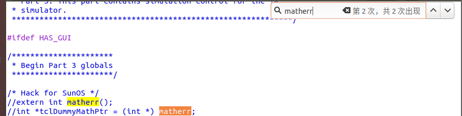

#### 运行成功截图

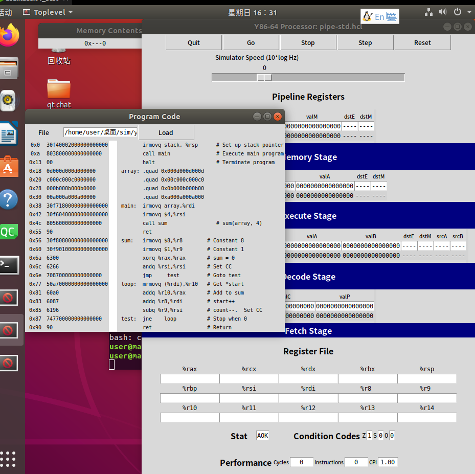

## Part-A

编写 Y86-64 简单程序，熟悉 Y86-64 工具。

### 第一题 sum.ys

编写 Y86-64 程序 sum.ys 对链表元素进行迭代求和。您的程序应该由一些代码组成，这些代
码设置栈结构，调用函数，然后停机。在这种情况下，函数应该是 Y86-64 代码（sum_list 函
数），功能等同于图 1 中 C sum_list 函数。使用以下三元素列表测试您的程序：

```
# Sample linked list
.align 8
ele1:
  .quad 0x00a
  .quad ele2
ele2:
  .quad 0x0b0
  .quad ele3
ele3:
  .quad 0xc00
  .quad 0
```

```c
/* linked list element */
typedef struct ELE {
    long val;
    struct ELE *next;
} *list_ptr;

/* sum_list - Sum the elements of a linked list */
long sum_list(list_ptr ls)
{
    long val = 0;
    while (ls) {
	    val += ls->val;
	    ls = ls->next;
    }
    return val;
}
```

这里直接参照 sim/y86-code/asum.yo 里面的格式进行 sum_list 的 Y86-64 汇编代码的编写，寄存器%rdi 保存参数，%rax 保存返回值。

sum.ys:

```
#name : 洪子翔
#ID : 1820211062
.pos 0
	irmovq stack, %rsp  	# Set up stack pointer
	call main		# Execute main program
	halt			# Terminate program

# Sample linked list
.align 8
ele1:
	.quad 0x00a
	.quad ele2
ele2:
  	.quad 0x0b0
  	.quad ele3
ele3:
  	.quad 0xc00
  	.quad 0

main:
	irmovq ele1,%rdi
	call sum_list
	ret

sum_list:
	irmovq $0,%rax
	irmovq $8,%r8
	andq %rdi,%rdi
	jmp     test

loop:
	mrmovq (%rdi),%r9
	addq	%r9,%rax
	mrmovq	8(%rdi),%rdi
	andq %rdi,%rdi

test:
	jne    loop
	ret

.pos 0x200
stack:
```

把 sum.ys 放入到 sim/y86-code，进行操作
结果：

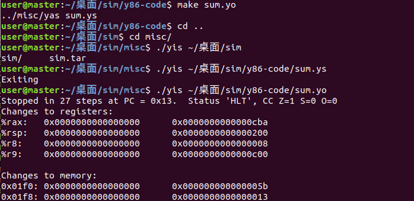

可以看到返回值(%rax)是 0xcba，正好是三个 value 相加的结果，说明程序正确。

为了后续方便编写，这里直接创建后面需要用到的两个 ys 文件


### 第二题 rsum.ys

编写一个 Y86-64 程序 rsum.ys 对链表元素进行递归求和。该代码应与 sum.ys 的代码类似，
但它使用一个函数 rsum_list 递归地对一系列数字求和，如图 1 中的 C 语言函数 rsum_list 所
示。使用与测试 list.ys 相同的三元素列表测试您的程序。

```c
/* linked list element */
typedef struct ELE {
    long val;
    struct ELE *next;
} *list_ptr;

/* rsum_list - Recursive version of sum_list */
long rsum_list(list_ptr ls)
{
    if (!ls)
	    return 0;
    else {
	    long val = ls->val;
	    long rest = rsum_list(ls->next);
	    return val + rest;
    }
}
```

这道题涉及到了递归，那就要对栈进行设计并维护寄存器和栈的值。与前一个函数相同，我们仍然使用寄存器%rdi 保存参数，寄存器%rax 保存返回结果。显而易见，我们必须维护寄存器%rax，因为如果不将其存储到栈中，递归调用的函数将覆盖其值。寄存器%rdi 也是如此，但有一个不同之处，%rdi 的值在递归函数开始返回后就再也不会被使用。因此，在这里，我选择不维护寄存器%rdi，而只维护寄存器%rax。

rsum.ys:

```
#name : 洪子翔
#ID : 1820211062
.pos 0
	irmovq stack,%rsp
	irmovq ele1,%rdi
	irmovq $0,%rax
	call rsum
	halt

.align 8
ele1:
	.quad 0x00a
	.quad ele2
ele2:
	.quad 0x0b0
	.quad ele3
ele3:
	.quad 0xc00
	.quad 0

rsum:
	andq %rdi,%rdi
	jmp test

calc:
	pushq %rax
	mrmovq (%rdi),%rax
	mrmovq 8(%rdi),%rdi
	call rsum
	popq %r8
	addq %r8,%rax
	ret

test:
	jne calc
	ret

.pos 0x200
stack:
```

结果：

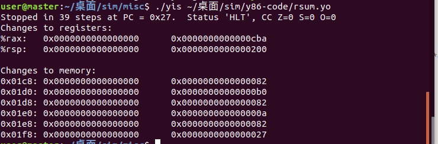

可以看到返回值(%rax)是 0xcba，正好是三个 value 相加的结果，说明程序正确。

### 第三题 copy.ys

编写一个程序（copy.ys），将一个若干字构成的数据块从内存的一部分复制到另一个（非重
叠区）内存区域，计算所有复制字的校验和（Xor）。

```c
/* linked list element */
typedef struct ELE {
    long val;
    struct ELE *next;
} *list_ptr;

/* copy_block - Copy src to dest and return xor checksum of src */
long copy_block(long *src, long *dest, long len)
{
    long result = 0;
    while (len > 0) {
	long val = *src++;
	*dest++ = val;
	result ^= val;
	len--;
    }
    return result;
}
```

寄存器%rdi 保存参数 src，%rsi 保存参数 dest，%rdx 保存参数 len，%rax 保存返回值。

copy.ys:

```
#name : 洪子翔
#ID : 1820211062
	.pos 0
	irmovq stack,%rsp
	call main
	halt

	.align 8
src:
	.quad 0x00a
	.quad 0x0b0
	.quad 0xc00

dest:
	.quad 0x111
	.quad 0x222
	.quad 0x333

main:
	irmovq src,%rdi
	irmovq dest,%rsi
	irmovq $3,%rdx

	call copy_block

	ret

copy_block:

	pushq %rbx

	xorq %rax,%rax
	irmovq $8,%r8
	irmovq $1,%r9

	andq %rdx,%rdx
	jle exit

loop:

	mrmovq (%rdi),%rbx
	addq %r8,%rdi

	rmmovq %rbx,(%rsi)
	addq %r8,%rsi

	xorq %rbx,%rax

	subq %r9,%rdx

	andq %rdx,%rdx
	jg loop

exit:
	popq %rbx
	ret


	.pos 0x200
stack:

```

结果：

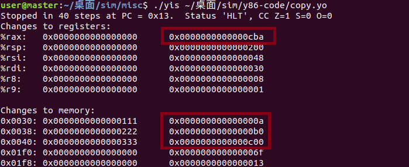

可以看到校验和%rax，是对的。dest 也被改变为 src 的值，说明复制过去了。

## Part-B

在本部分中，您将在目录 sim/seq 中工作。

您在 B 部分的任务是扩展 SEQ 处理器以支持 iaddq 指令，如家庭作业问题 4.51 和 4.52 所述。
要添加此指令，您将修改文件 seq-full.hcl，它实现了 CS:APP3e 教科书中描述的 SEQ 版本。
此外，它还包含解决方案所需的一些常量的声明。

HCL 文件必须以注释头开始，其中包含以下信息：

- 您的姓名和 ID。

- iaddq 指令所需计算的描述。参考 CS:APP3e 教材中图 4.18 中的 irmovq 和 OPq 描述。

根据以上提示，写出了 iaddq 在顺序实现中的计算
| 阶段 | iaddq V , rB |
| ------ | -------------------------- |
| 取指 | $icode:ifun<-M1[PC]$ |
| | $rA:rB<-M1[PC+1]$ |
| | $valC<-M8[PC+2]$ |
| | $valC<-M8[PC+2]$ |
| 译码 | $valB<-R[rB]$ |
| 执行 | $valE<-valB+valC$ |
| | $Set CC$ |
| 访存 | |
| 写回 | $ R[rB]<-valE$ |
| 更新 PC | $ PC<-valP$ |

明确好了各个阶段该干什么，那就去更新各个阶段的 hcl 表达式

1. 取指

更新 instr_valid, need_regids, need_valC，在集合内添加 IADDQ

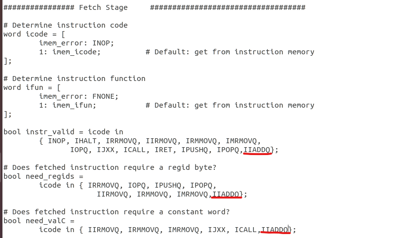

2. 译码与写回

更新 srcB, dstE

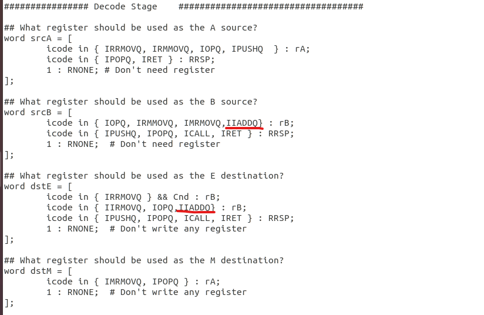

3. 执行

更新 aluA, aluB, set_cc
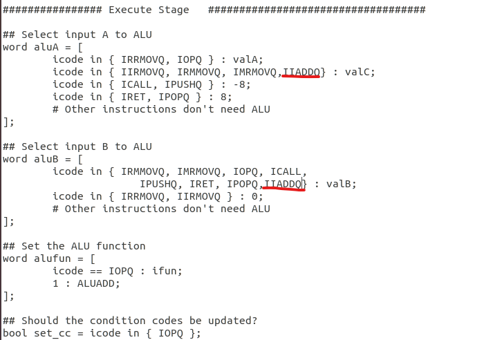

访存跟更新 PC 都不需要进行更改

完整代码：

```
#name : 洪子翔
#ID : 1820211062
#/* $begin seq-all-hcl */
####################################################################
#  HCL Description of Control for Single Cycle Y86-64 Processor SEQ   #
#  Copyright (C) Randal E. Bryant, David R. O'Hallaron, 2010       #
####################################################################

## Your task is to implement the iaddq instruction
## The file contains a declaration of the icodes
## for iaddq (IIADDQ)
## Your job is to add the rest of the logic to make it work

####################################################################
#    C Include's.  Don't alter these                               #
####################################################################

quote '#include <stdio.h>'
quote '#include "isa.h"'
quote '#include "sim.h"'
quote 'int sim_main(int argc, char *argv[]);'
quote 'word_t gen_pc(){return 0;}'
quote 'int main(int argc, char *argv[])'
quote '  {plusmode=0;return sim_main(argc,argv);}'

####################################################################
#    Declarations.  Do not change/remove/delete any of these       #
####################################################################

##### Symbolic representation of Y86-64 Instruction Codes #############
wordsig INOP 	'I_NOP'
wordsig IHALT	'I_HALT'
wordsig IRRMOVQ	'I_RRMOVQ'
wordsig IIRMOVQ	'I_IRMOVQ'
wordsig IRMMOVQ	'I_RMMOVQ'
wordsig IMRMOVQ	'I_MRMOVQ'
wordsig IOPQ	'I_ALU'
wordsig IJXX	'I_JMP'
wordsig ICALL	'I_CALL'
wordsig IRET	'I_RET'
wordsig IPUSHQ	'I_PUSHQ'
wordsig IPOPQ	'I_POPQ'
# Instruction code for iaddq instruction
wordsig IIADDQ	'I_IADDQ'

##### Symbolic represenations of Y86-64 function codes                  #####
wordsig FNONE    'F_NONE'        # Default function code

##### Symbolic representation of Y86-64 Registers referenced explicitly #####
wordsig RRSP     'REG_RSP'    	# Stack Pointer
wordsig RNONE    'REG_NONE'   	# Special value indicating "no register"

##### ALU Functions referenced explicitly                            #####
wordsig ALUADD	'A_ADD'		# ALU should add its arguments

##### Possible instruction status values                             #####
wordsig SAOK	'STAT_AOK'	# Normal execution
wordsig SADR	'STAT_ADR'	# Invalid memory address
wordsig SINS	'STAT_INS'	# Invalid instruction
wordsig SHLT	'STAT_HLT'	# Halt instruction encountered

##### Signals that can be referenced by control logic ####################

##### Fetch stage inputs		#####
wordsig pc 'pc'				# Program counter
##### Fetch stage computations		#####
wordsig imem_icode 'imem_icode'		# icode field from instruction memory
wordsig imem_ifun  'imem_ifun' 		# ifun field from instruction memory
wordsig icode	  'icode'		# Instruction control code
wordsig ifun	  'ifun'		# Instruction function
wordsig rA	  'ra'			# rA field from instruction
wordsig rB	  'rb'			# rB field from instruction
wordsig valC	  'valc'		# Constant from instruction
wordsig valP	  'valp'		# Address of following instruction
boolsig imem_error 'imem_error'		# Error signal from instruction memory
boolsig instr_valid 'instr_valid'	# Is fetched instruction valid?

##### Decode stage computations		#####
wordsig valA	'vala'			# Value from register A port
wordsig valB	'valb'			# Value from register B port

##### Execute stage computations	#####
wordsig valE	'vale'			# Value computed by ALU
boolsig Cnd	'cond'			# Branch test

##### Memory stage computations		#####
wordsig valM	'valm'			# Value read from memory
boolsig dmem_error 'dmem_error'		# Error signal from data memory


####################################################################
#    Control Signal Definitions.                                   #
####################################################################

################ Fetch Stage     ###################################

# Determine instruction code
word icode = [
	imem_error: INOP;
	1: imem_icode;		# Default: get from instruction memory
];

# Determine instruction function
word ifun = [
	imem_error: FNONE;
	1: imem_ifun;		# Default: get from instruction memory
];

bool instr_valid = icode in
	{ INOP, IHALT, IRRMOVQ, IIRMOVQ, IRMMOVQ, IMRMOVQ,
	       IOPQ, IJXX, ICALL, IRET, IPUSHQ, IPOPQ,IIADDQ};

# Does fetched instruction require a regid byte?
bool need_regids =
	icode in { IRRMOVQ, IOPQ, IPUSHQ, IPOPQ,
		     IIRMOVQ, IRMMOVQ, IMRMOVQ,IIADDQ};

# Does fetched instruction require a constant word?
bool need_valC =
	icode in { IIRMOVQ, IRMMOVQ, IMRMOVQ, IJXX, ICALL,IIADDQ};

################ Decode Stage    ###################################

## What register should be used as the A source?
word srcA = [
	icode in { IRRMOVQ, IRMMOVQ, IOPQ, IPUSHQ  } : rA;
	icode in { IPOPQ, IRET } : RRSP;
	1 : RNONE; # Don't need register
];

## What register should be used as the B source?
word srcB = [
	icode in { IOPQ, IRMMOVQ, IMRMOVQ,IIADDQ} : rB;
	icode in { IPUSHQ, IPOPQ, ICALL, IRET } : RRSP;
	1 : RNONE;  # Don't need register
];

## What register should be used as the E destination?
word dstE = [
	icode in { IRRMOVQ } && Cnd : rB;
	icode in { IIRMOVQ, IOPQ,IIADDQ} : rB;
	icode in { IPUSHQ, IPOPQ, ICALL, IRET } : RRSP;
	1 : RNONE;  # Don't write any register
];

## What register should be used as the M destination?
word dstM = [
	icode in { IMRMOVQ, IPOPQ } : rA;
	1 : RNONE;  # Don't write any register
];

################ Execute Stage   ###################################

## Select input A to ALU
word aluA = [
	icode in { IRRMOVQ, IOPQ } : valA;
	icode in { IIRMOVQ, IRMMOVQ, IMRMOVQ,IIADDQ} : valC;
	icode in { ICALL, IPUSHQ } : -8;
	icode in { IRET, IPOPQ } : 8;
	# Other instructions don't need ALU
];

## Select input B to ALU
word aluB = [
	icode in { IRMMOVQ, IMRMOVQ, IOPQ, ICALL,
		      IPUSHQ, IRET, IPOPQ,IIADDQ} : valB;
	icode in { IRRMOVQ, IIRMOVQ } : 0;
	# Other instructions don't need ALU
];

## Set the ALU function
word alufun = [
	icode == IOPQ : ifun;
	1 : ALUADD;
];

## Should the condition codes be updated?
bool set_cc = icode in { IOPQ,IIADDQ};

################ Memory Stage    ###################################

## Set read control signal
bool mem_read = icode in { IMRMOVQ, IPOPQ, IRET };

## Set write control signal
bool mem_write = icode in { IRMMOVQ, IPUSHQ, ICALL };

## Select memory address
word mem_addr = [
	icode in { IRMMOVQ, IPUSHQ, ICALL, IMRMOVQ } : valE;
	icode in { IPOPQ, IRET } : valA;
	# Other instructions don't need address
];

## Select memory input data
word mem_data = [
	# Value from register
	icode in { IRMMOVQ, IPUSHQ } : valA;
	# Return PC
	icode == ICALL : valP;
	# Default: Don't write anything
];

## Determine instruction status
word Stat = [
	imem_error || dmem_error : SADR;
	!instr_valid: SINS;
	icode == IHALT : SHLT;
	1 : SAOK;
];

################ Program Counter Update ############################

## What address should instruction be fetched at

word new_pc = [
	# Call.  Use instruction constant
	icode == ICALL : valC;
	# Taken branch.  Use instruction constant
	icode == IJXX && Cnd : valC;
	# Completion of RET instruction.  Use value from stack
	icode == IRET : valM;
	# Default: Use incremented PC
	1 : valP;
];
#/* $end seq-all-hcl */
```

### 测试结果正确性

#### 简单测试

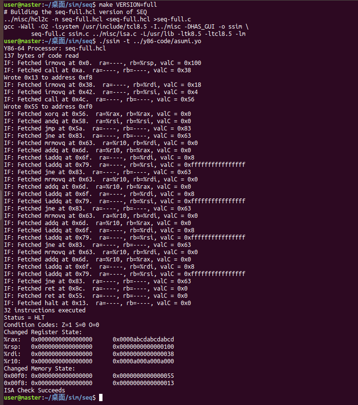

成功！

#### 基准程序自动测试

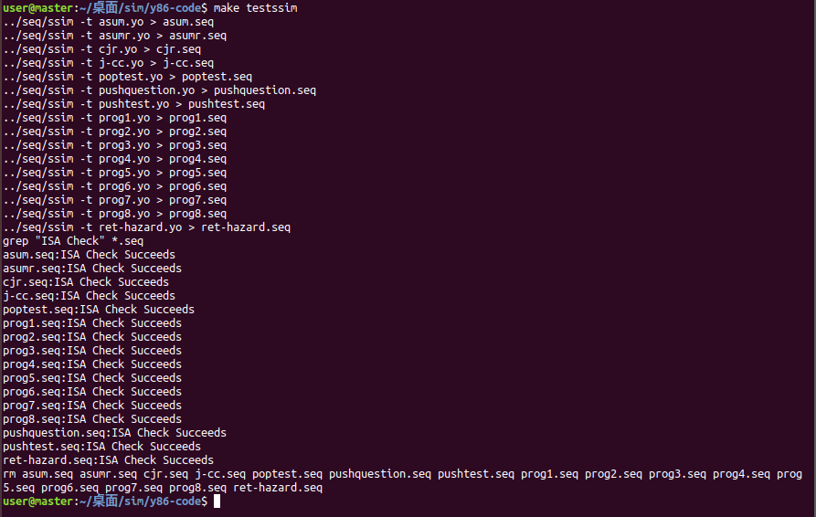

全部通过

#### 大量回归测试

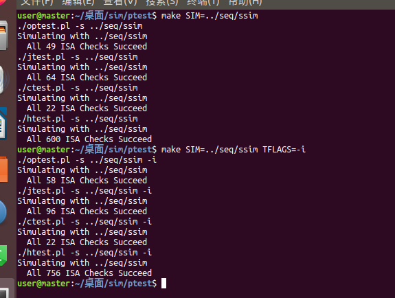

全部通过

我在 ssim 上面出现了很多问题，重装了几次还是一样的结果，不是 std 就是 full 跑不动，说找不到地址，参考 lexue 上的文本在 seq 下使用以下语句才成功通过，一开始还一直以为 seq-full.hcl 里写错了

```
linux > make VERSION=full
```

## Part-C

在本部分中，您将在目录 sim/pipe 中工作。

以下图中的 ncopy 函数将 len 元素整数数组 src 复制到一个不重叠的 dst，重新计算 src 中包含的正整数数。

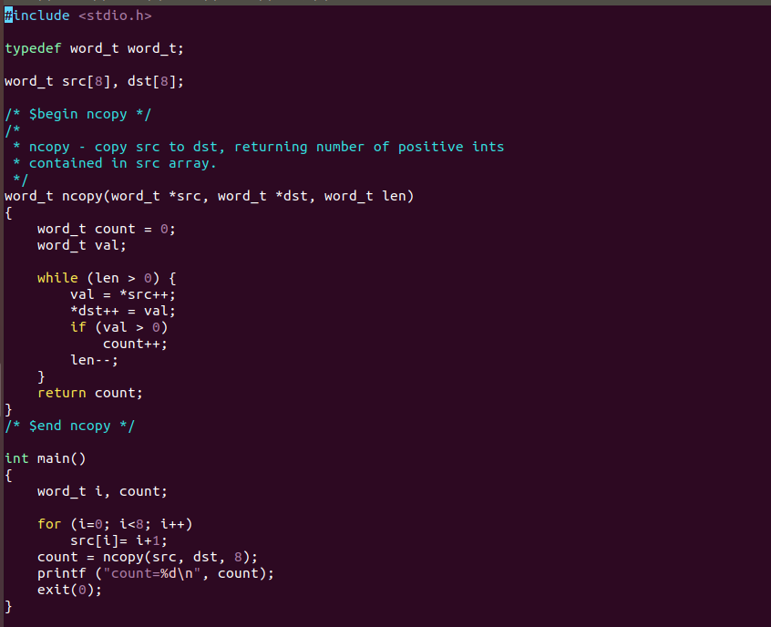

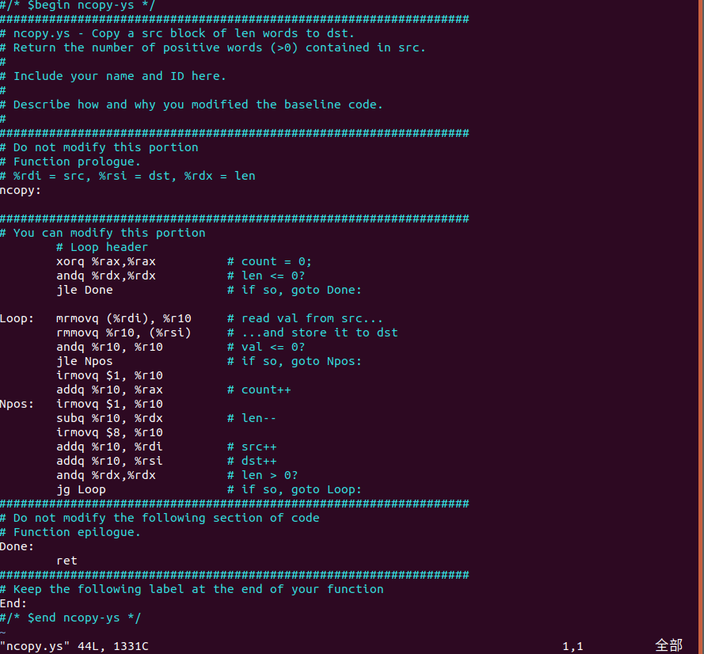

在 C 部分中，您的任务是修改 ncopy.ys 和 pipe-full.hcl，以创建 ncopy。让我们尽可能快地运行。
测试了一下默认版本的，CPE 平均为 15.18，和文档写的一样，只是熟悉下流程。文档中写道他们最好的版本平均为 7.48。得到满分需要将 CPE 降至 7.5 以下

### 实现 iaddq

需修改 pipe-full.hcl，iaddq 实现和 Part-B 种实现的一样，直接上代码修改部分

1. 取值部分

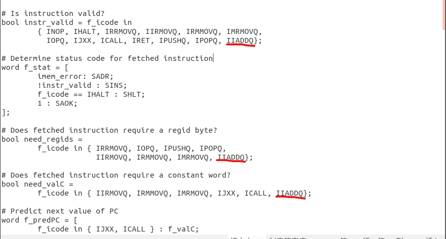

2. 译码阶段

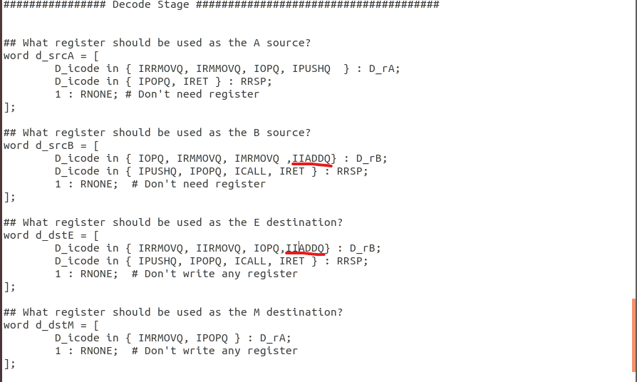

3. 执行阶段

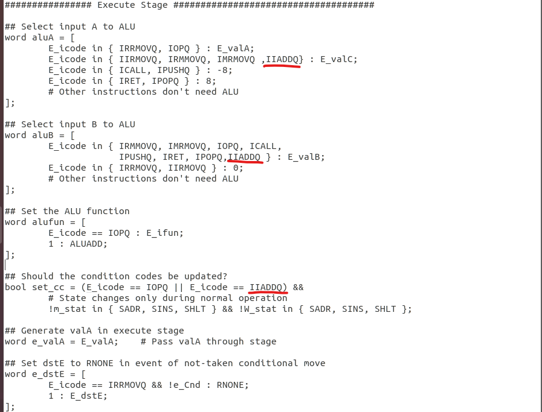

跟 Part-B 一样，其余的部分不需要更改

进行测试

##### 记得一定也要换成 full

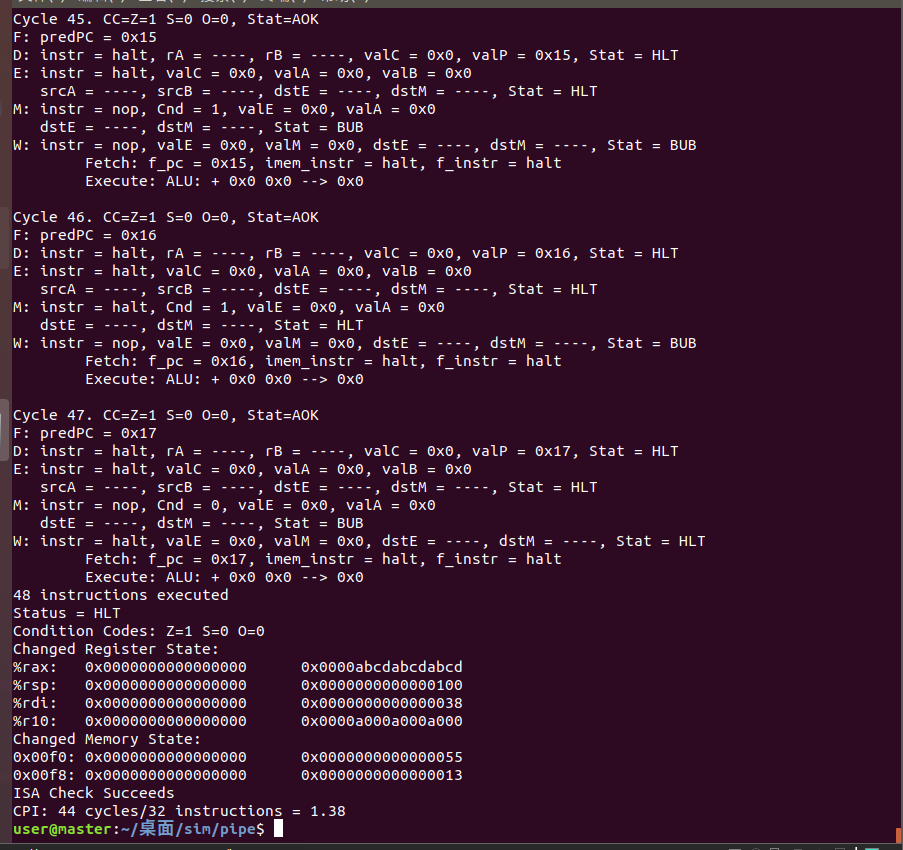

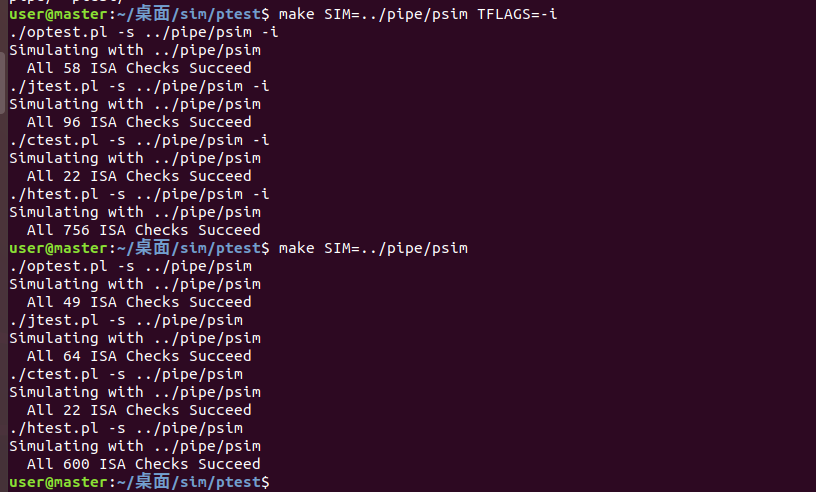

测试成功。

### 优化

首先，开始尝试优化并熟悉流程，把以下代码

```
irmovq $1, %r10
addq %r10, %rax
```

转换成

```
iaddq $1,%rax
```

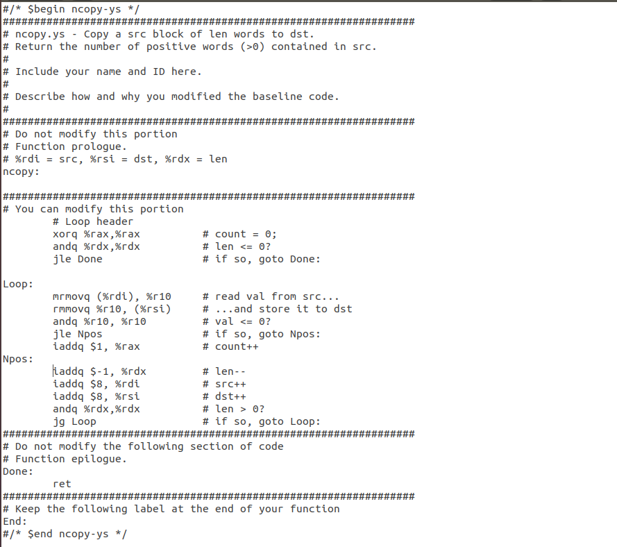

根据文档每次修改 ncopy.ys，可以通过键入重建驱动程序

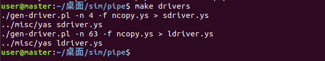

将构造一下两个有用的驱动程序：

- sdriver.yo:一种小型驱动程序，它在带有 4 个元素的小数组上测试 ncopy 函数。如果您的解决方案是正确的，那么这个程序将在复制 src 数组后在寄存器%rax 中以 2 的值停止。

- ldriver.yo:一个大型驱动程序，它在带有 63 个元素的较大数组上测试一个 ncopy 函数。如果您的解决方案是正确的，那么在复制 src 数组之后，这个程序将在寄存器%rax 中的值为 31 (0x1f)时停止

先用小的 4 元素数组（sdriver.yo）测试解决方案

```
linux > ./psim -t sdriver.yo
```

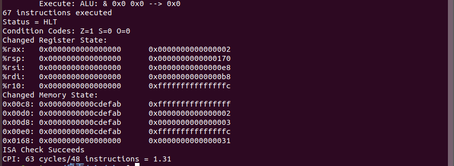

测试正确

用大的 63 元素数组（ldriver.yo）测试解决方案

```
linux > ./psim -t ldriver.yo
```

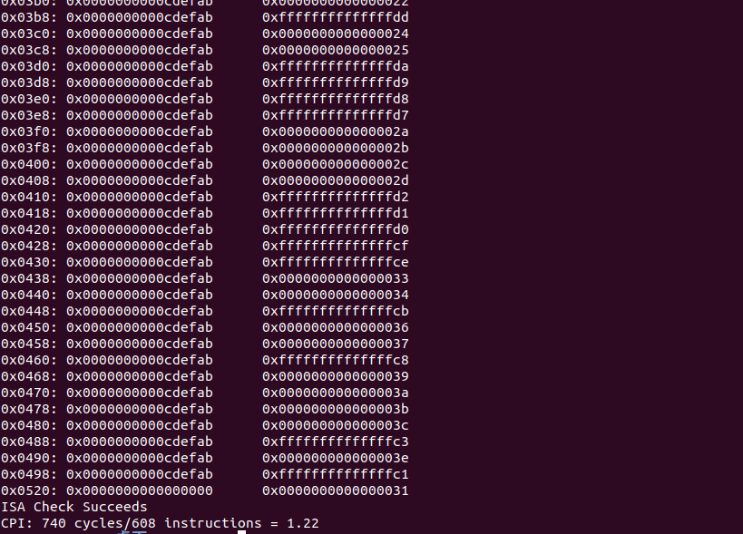

测试正确

再进行其他的测试

使用 ISA 模拟器在块长度范围内测试代码。Perl 脚本 correctness.pl 生成的驱动程序文件块长度从 0 到某个限制(默认值为 65)，再加上一些更大的块长度。它模拟它们(默认情况下使用 YIS)，并检查结果。它生成一个报告，显示每个块长度的状态:

```
linux > ./correctness.pl
```

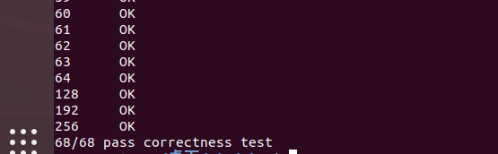

正常

在基准程序上测试管道模拟器。一旦你的模拟器能够正确地执行 sdriver.ys 和 ldriver.ys，你应该在…/y86-code 中测试 Y86-64 基准程序:

```
linux > (cd ../y86-code;make testpsim)
```

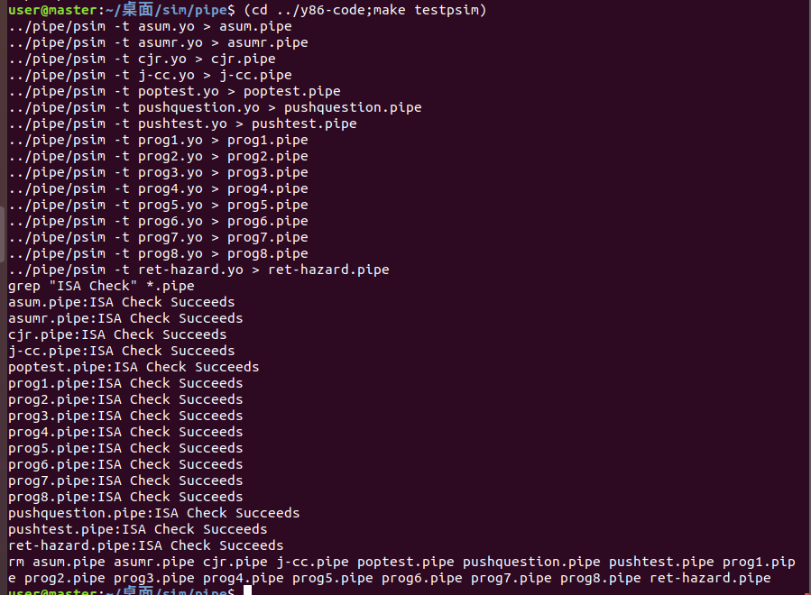

测试成功

使用大量回归测试测试管道模拟器。一旦可以正确地执行基准测试程序，就应该使用…/ptest 中的回归测试来检查它。例如，如果您的解决方案实现了 iaddq 指令，那么

```
linux > (cd ../ptest;make SIM=../pipe/psim TFLAGS=-i)
```

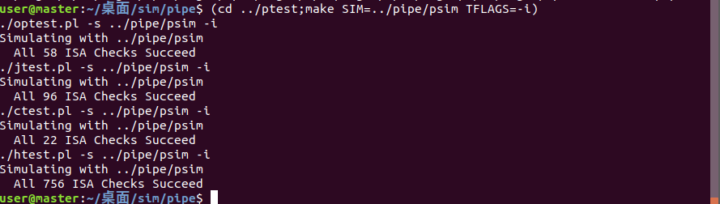

测试成功

使用流水线模拟器在一定范围的块长度上测试代码。最后，您可以在管道模拟器上运行与前面使用 ISA 模拟器所做的相同的代码测试

```
linux > ./correctness.pl -p
```

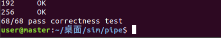

### 计算 CPE 值

```
linux > ./benchmark.pl
```


发现现在还是 0 分，以上是我进行 Part-3 的整体流程

本题最核心的是实现对循环内指令并行度的提升，经过不断地调整，调整的核心是使用第五章优化程序的循环方法为基础进行测试变更，最终终于得到 CPE：7.49 的成绩

#### 最终代码

```
#name : 洪子翔
#ID : 1820211062
#/* $begin ncopy-ys */
##################################################################
# ncopy.ys - Copy a src block of len words to dst.
# Return the number of positive words (>0) contained in src.
#
# Include your name and ID here.
#
# Describe how and why you modified the baseline code.
#
##################################################################
# Do not modify this portion
# Function prologue.
# %rdi = src, %rsi = dst, %rdx = len
ncopy:

##################################################################
# You can modify this portion
	# Loop header

	iaddq $-10,%rdx		#判断是否有10个数(含)以上
	jl remain

Loop:
	mrmovq (%rdi), %r8
	mrmovq 8(%rdi),%r9

	rmmovq %r8, (%rsi)
	rmmovq %r9,8(%rsi)

	andq %r8, %r8
	jle two
	iaddq $1,%rax
two:
	andq %r9,%r9
	jle three
	iaddq $1, %rax
three:
	mrmovq 16(%rdi),%r8
	mrmovq 24(%rdi),%r9

	rmmovq %r8,16(%rsi)
	rmmovq %r9,24(%rsi)

	andq %r8,%r8
	jle four
	iaddq $1,%rax
four:
	andq %r9,%r9
	jle five
	iaddq $1,%rax
five:
	mrmovq 32(%rdi),%r8
	mrmovq 40(%rdi),%r9

	rmmovq %r8,32(%rsi)
	rmmovq %r9,40(%rsi)

	andq %r8,%r8
	jle six
	iaddq $1,%rax
six:
	andq %r9,%r9
	jle seven
	iaddq $1,%rax
seven:
	mrmovq 48(%rdi),%r8
	mrmovq 56(%rdi),%r9

	rmmovq %r8,48(%rsi)
	rmmovq %r9,56(%rsi)

	andq %r8,%r8
	jle eight
	iaddq $1,%rax
eight:
	andq %r9,%r9
	jle nine
	iaddq $1,%rax
nine:
	mrmovq 64(%rdi),%r8
	mrmovq 72(%rdi),%r9

	rmmovq %r8,64(%rsi)
	rmmovq %r9,72(%rsi)

	andq %r8,%r8
	jle ten
	iaddq $1,%rax
ten:
	andq %r9,%r9
	jle Npos
	iaddq $1,%rax
Npos:

	iaddq $80, %rdi			#src+10
	iaddq $80, %rsi			#dst+10

	iaddq $-10, %rdx			#下一轮循环

	jge Loop

remain:						#剩余的
	iaddq $7,%rdx
	jl left					#len<3
	jg right				#len>3
	je remain3				#len==3

left:
	iaddq $2,%rdx			#len==1
	je remain1
	iaddq $-1,%rdx			#len==2
	je remain2
	ret 					#len==0

right:
	iaddq $-3,%rdx			#len<=6
	jg rightRight
	je remain6 				#len==6

	iaddq $1,%rdx
	je remain5 				#len==5
	jmp remain4 			#len==4
rightRight:
	iaddq $-2,%rdx
	jl remain7
	je remain8

remain9:
	mrmovq 64(%rdi),%r8
	andq %r8,%r8
	rmmovq %r8,64(%rsi)

remain8:
	mrmovq 56(%rdi),%r8
	jle remain82
	iaddq $1,%rax

remain82:
	rmmovq %r8,56(%rsi)
	andq %r8,%r8
remain7:
	mrmovq 48(%rdi),%r8
	jle remain72
	iaddq $1,%rax
remain72:
	rmmovq %r8,48(%rsi)
	andq %r8,%r8
remain6:
	mrmovq 40(%rdi),%r8
	jle remain62
	iaddq $1,%rax
remain62:
	rmmovq %r8,40(%rsi)
	andq %r8,%r8
remain5:
	mrmovq 32(%rdi),%r8
	jle remain52
	iaddq $1,%rax
remain52:
	rmmovq %r8,32(%rsi)
	andq %r8,%r8
remain4:
	mrmovq 24(%rdi),%r8
	jle remain42
	iaddq $1,%rax
remain42:
	rmmovq %r8,24(%rsi)
	andq %r8,%r8
remain3:
	mrmovq 16(%rdi),%r8
	jle remain32
	iaddq $1,%rax
remain32:
	rmmovq %r8,16(%rsi)
	andq %r8,%r8
remain2:
	mrmovq 8(%rdi),%r8
	jle remain22
	iaddq $1,%rax
remain22:
	rmmovq %r8,8(%rsi)
	andq %r8,%r8
remain1:
	mrmovq (%rdi),%r8
	jle remain12
	iaddq $1,%rax
remain12:
	rmmovq %r8,(%rsi)
	andq %r8,%r8
	jle Done
	iaddq $1,%rax


##################################################################
# Do not modify the following section of code
# Function epilogue.
Done:
	ret
##################################################################
# Keep the following label at the end of your function
End:
#/* $end ncopy-ys */

```

#### CPE 计算

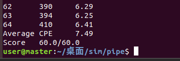

成功！！！
